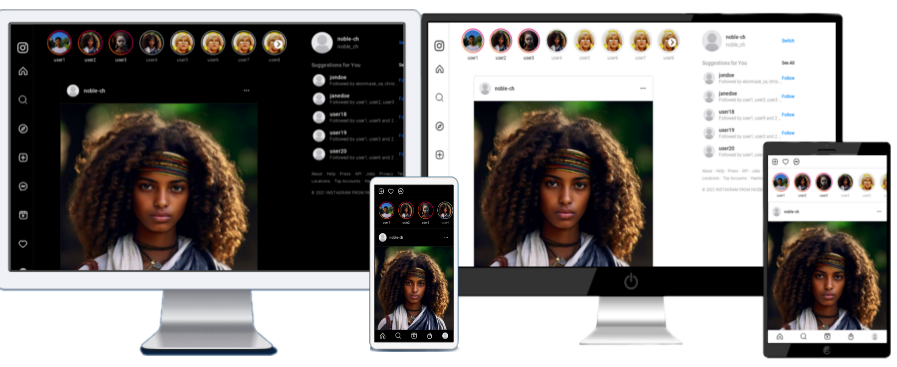

<h1 align="center">Instagram Frontend Clone</h1>

<p align="center">
  
  <!--  -->
</p>

## Overview

<p align="center">
<p >Welcome to the Instagram Frontend Clone project! This project aims to replicate the frontend design of Instagram using HTML5, CSS3, and JavaScript. It features a responsive design with support for both dark and light modes, along with animations to enhance the user experience.</p>

## Check out the live demo: [Instagram Frontend Clone](https://nobagram.vercel.app)

<p align="center">
  
</p>

## Features

- **Responsive Design:** Ensures compatibility across various devices and screen sizes.
- **Dark and Light Modes:** Switch between dark and light modes seamlessly.
- **Smooth Animations:** Enhances user interaction with smooth animations.
- **Interactive Elements:** Buttons, sliders, and other interactive elements for a dynamic experience.
- **Easy Customization:** Easily customize colors, fonts, and other design elements.

## Technologies Used

- HTML5
- CSS3
- JavaScript

## Usage

To use the Instagram Frontend Clone, simply open the `index.html` file in your web browser. You can also view the live demo [here](https://nobagram.vercel.app).

## Contributing

Contributions are welcome! If you'd like to contribute to the project, please follow these steps:

1. Fork the repository
2. Create a new branch (`git checkout -b feature`)
3. Make your changes
4. Commit your changes (`git commit -am 'Add new feature'`)
5. Push to the branch (`git push origin feature`)
6. Create a new Pull Request

## Installation

Clone the repository and open `index.html` in your preferred web browser:

```bash
git clone https://github.com/noble-ch/instagram-clone.git
cd instagram-clone

```

<h2>Acknowledgements</h2>

- Instagram for the inspiration
- Icons from [FontAwesome](https://fontawesome.com/)
- Images from [Unsplash](https://unsplash.com/)

## Contact

For any inquiries or feedback, feel free to contact me at [noblebarch@gmail.com](mailto:noblebarch@@gmail.com).
